# ✉️ Mail Box

Mail Box is a modern, Gmail-inspired web app that lets you send, receive, and manage emails in real time — with profile personalization, secure authentication, and a rich text email composer.

## 🛠 Built With

- ⚛️ React.js

- 🎨 CSS  

- 🔄 Redux Toolkit

- 🧩 Formik + Yup  

- 🔥 Firebase Authentication  

- 💾 Firebase Realtime Database  

- 📝 Draft.js  

## ⚙️ Key Features

- 🔐 Authentication (Signup, Login, Password Reset)

- 📨 Real-time email exchange between users

- ✍️ Rich Email Editor (with formatting & emojis)

- 🗑 Delete emails locally (without removing them for the other user’s copy)

- 👤 Profile Customization (upload photo + edit username)

- 📱 Clean & Responsive UI

## 🎨 Design Inspiration & Decisions

When I started building the project, we were told to use Bootstrap for the UI. I tried using it at first, but I felt the design looked too basic and not modern enough. After discussing it with my mentor, I realized I could do better. So I started exploring design inspiration online, and that’s when I found a beautiful glassmorphism-based website. I really liked its frosted-glass look and minimal style. From that moment, I decided to build my own Mail Box project using the **glassmorphism design approach** to give it a clean, modern, and elegant feel.

To create the glassmorphism effect, I used a semi-transparent background with a blur. Here's a simplified version of the CSS I used:

```css
background-color: hsla(0, 0%, 100%, 0.05);
border-bottom: 1px solid hsla(0, 0%, 100%, 0.12);

backdrop-filter: blur(10px); /* adds a blur behind the element */
-webkit-backdrop-filter: blur(10px); /* fallback */
```

> 🧠 Inspiration Source: [Glassmorphism Design Website](https://reflect.app/)

## Integrating Draft.js — My Experience & How I Solved Issues

I chose **Draft.js** to build the rich text editor for my Mail Box app. After installing the necessary libraries and setting it up, I ran into a frustrating error:

> `global is not defined.`

At first, I was confused. I carefully retraced all my setup steps, but the error wouldn’t go away. Like many developers these days, I turned to ChatGPT for help. Unfortunately, the suggestions it gave didn’t fix the problem. ChatGPT even recommended switching to another editor like Quill.

I tried Quill, but it had its own set of errors. Then I went back to ChatGPT, and this time it suggested trying a third editor altogether — which I didn’t want to do.

So, I looked for solutions elsewhere. YouTube videos on this topic were either outdated or not very helpful. Finally, after digging through blogs and Stack Overflow, I found an answer that worked:

Adding this small script snippet inside the HTML file fixed the error:

```html
<script>
  const global = globalThis;
</script>
```

But that wasn’t the end of it. When I tried deploying to Vercel, the error popped up again. To solve it this time, I ran:

```bash
npm install --legacy-peer-deps && npm run build
```

This command forced the installation to ignore some dependency conflicts, and the build worked perfectly.

> 💡 Solution Reference: [StackOverflow: Fix for “global is not defined” in Draft.js](https://stackoverflow.com/questions/65586906/react-and-electron-with-draft-js-global-is-not-defined)


### How to Integrate Draft.js and Related Libraries in Your Project

---

#### 1. Install Draft.js, react-draft-wysiwyg, and draftjs-to-html:

```bash
npm install draft-js react-draft-wysiwyg draftjs-to-html
```

#### 2. Fix the “global is not defined” error:

Add this snippet inside your main `index.html `or equivalent:

```html
<script>
  const global = globalThis;
</script>
```

#### 3. Set up your editor component:

* Import `Editor` from `react-draft-wysiwyg` and `EditorState` from `draft-js`.

* Initialize your editor state with `EditorState.createEmpty()`.

* Handle editor state changes with a function.

* Use `draftjs-to-html` to convert the editor content into HTML when saving or sending emails.

#### 4. Saving & Loading Content:

* Serialize editor content using `convertToRaw` from `Draft.js` to store in Firebase.

* Deserialize stored content with `convertFromRaw` when loading emails for editing or viewing.

#### 5. Add toolbar and styling:

* The `react-draft-wysiwyg` package provides a ready-made toolbar for formatting, emoji insertion, and more.

* Customize the toolbar as needed for your app’s UX.


## 🧠 How I Handled Firebase’s Auto-Login After Signup

When someone signs up using Firebase’s `createUserWithEmailAndPassword` function, Firebase **automatically logs them in**. This might be okay in some cases, but in my app, it created a problem.

Here’s what I needed to do right after a new user signs up:

- ✅ Update their **username**
- ✅ Set a **default profile picture**

But since Firebase auto-logs in the user right after signup, the `onAuthStateChanged` listener would trigger immediately — and the user would be sent to the home page **before** these updates were completed.

---

### 🛠 What I Tried

My first idea was:  
> `Why not logout the user right after signup?`

So I called `signOut()` immediately after signup.

That *almost* worked — but there was one issue:  
For a brief moment, the user was still being redirected to the home page, and **then** they were logged out and sent back to the login screen.  
It felt janky and confusing from a user experience perspective.

---

### ✅ Final Solution: Using a Flag in Redux

So I came up with a better approach:

I added a new flag called `isSigningUp` in my **Auth Slice (Redux)**. Here's how I used it:

1. When a user starts signing up, I set `isSigningUp = true`.

2. Then, inside the `onAuthStateChanged` listener, I check this flag.
   - If `isSigningUp` is `true`, I **skip** the logic that redirects to the home page.

3. After calling `signOut()` and redirecting the user to the login page, I reset `isSigningUp = false`.

This way:

- Firebase still logs the user in behind the scenes.

- But I **intercept that behavior** using the flag and stop the app from treating the user as "fully logged in."

- The user never sees the home page unless they've logged in manually after signup and profile setup.

> 🧠 Firebase Auto-Login Behavior: [Stack Overflow Discussion](https://stackoverflow.com/questions/64439274/firebase-authentication-remove-auto-login-upon-signing-up)

> 💡 I came up with this solution myself. All I needed was to understand that Firebase’s behavior couldn’t be changed — the rest was just logical puzzle-solving. 😎

## 📸 Preview

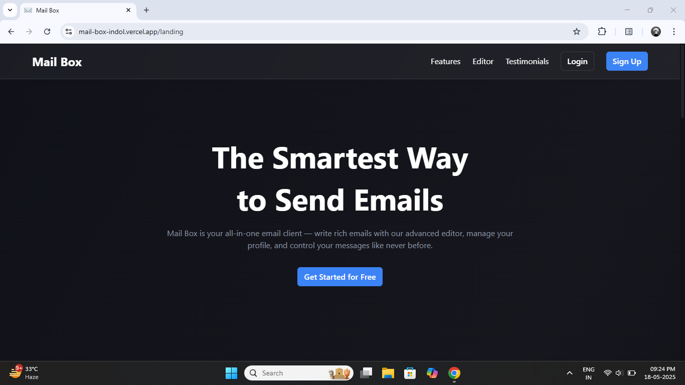
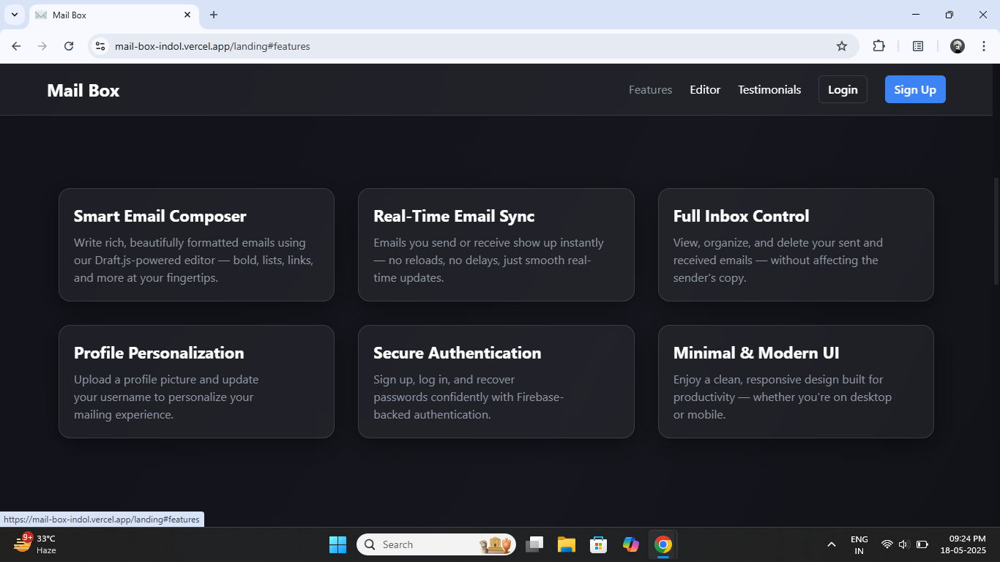
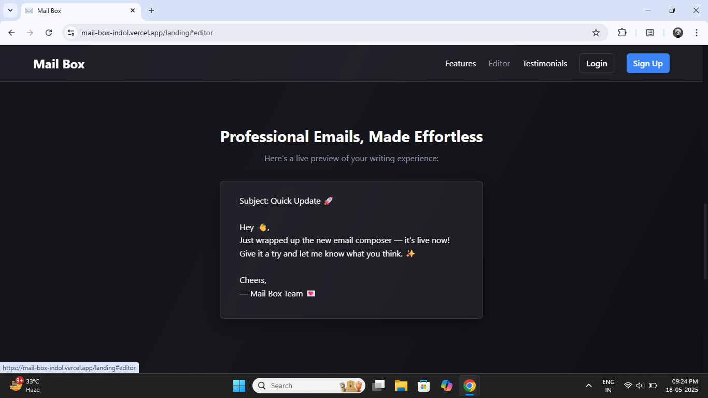
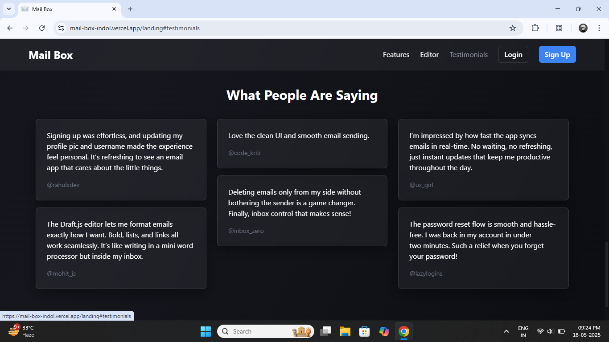
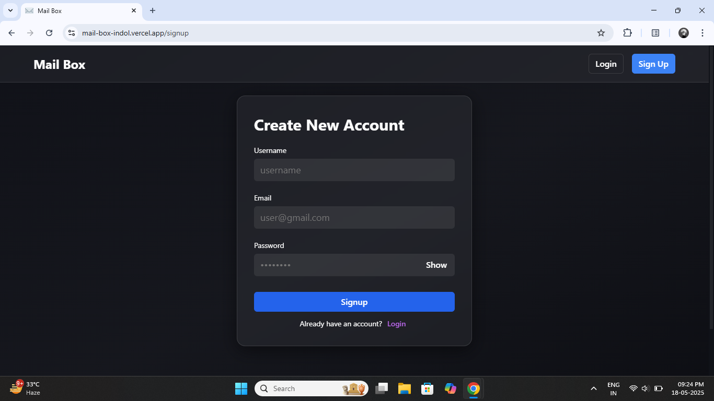
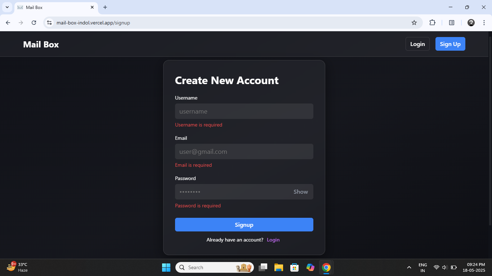
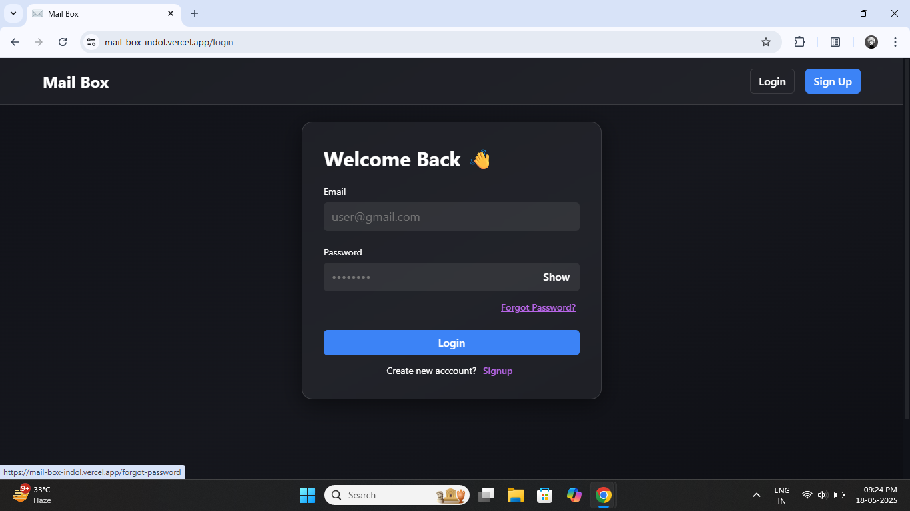
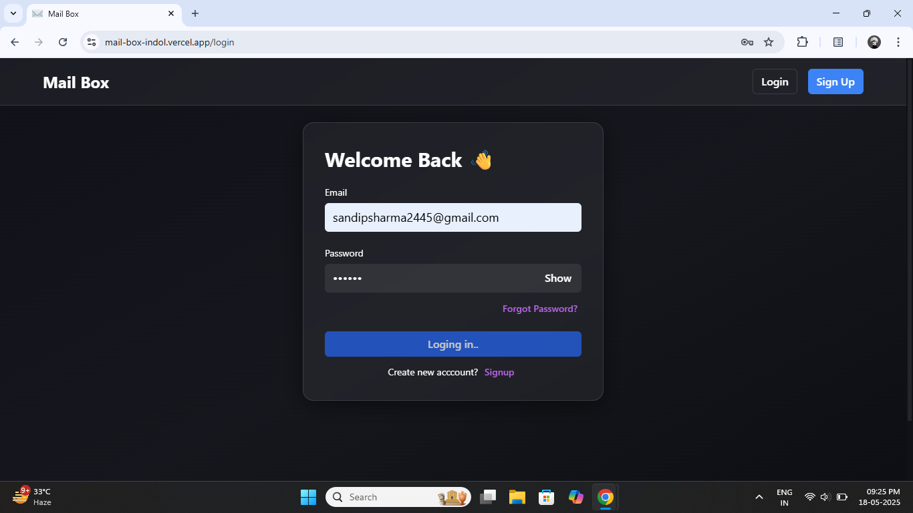
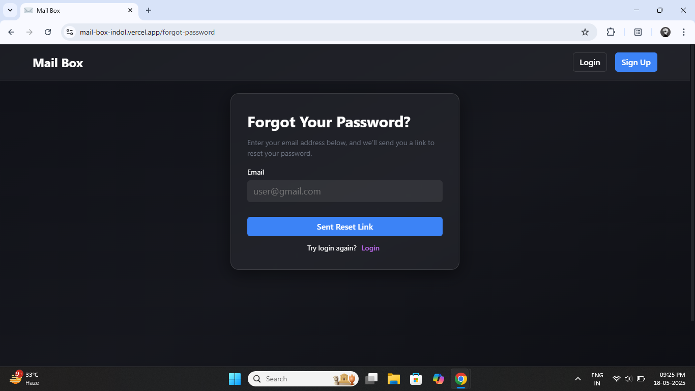
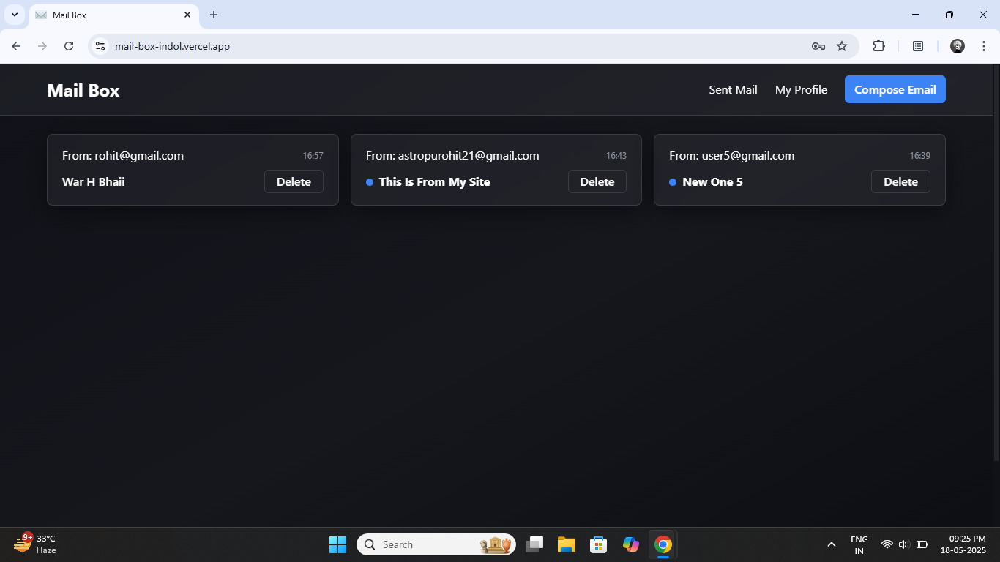
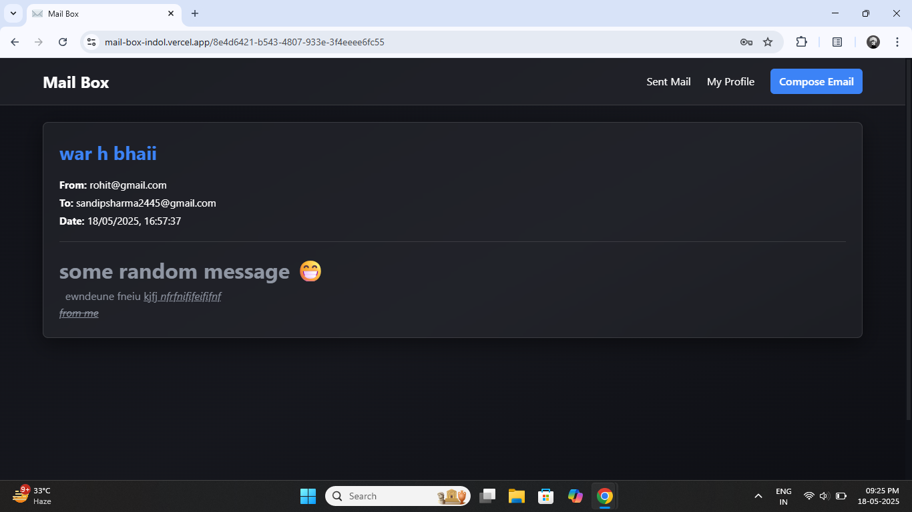
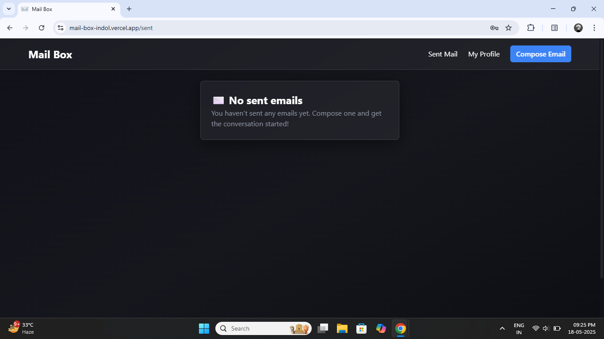
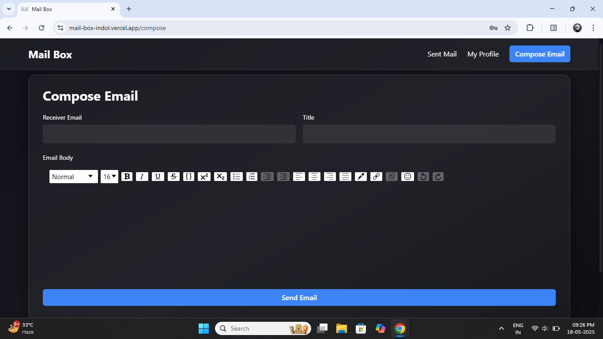
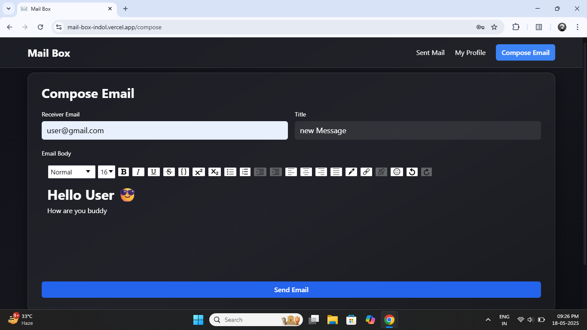
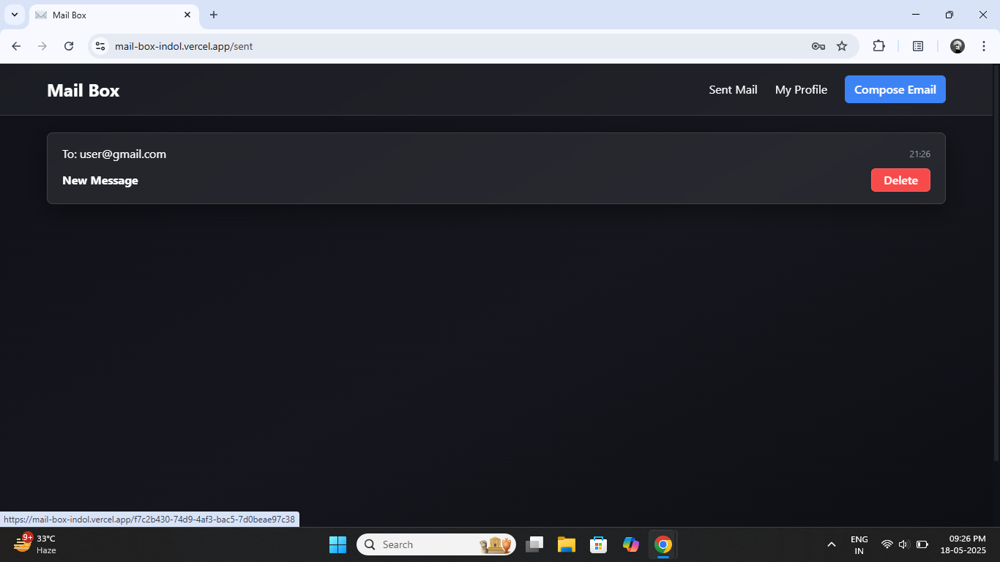

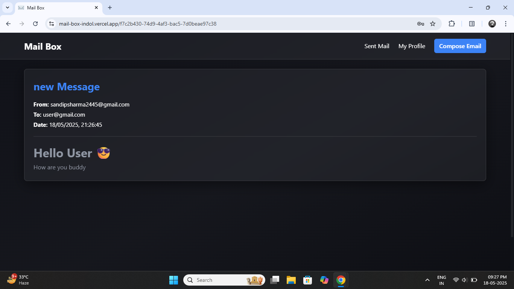
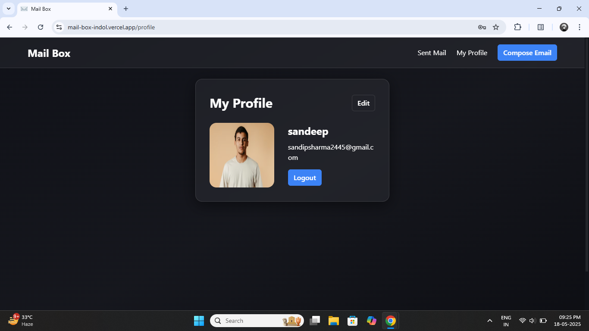
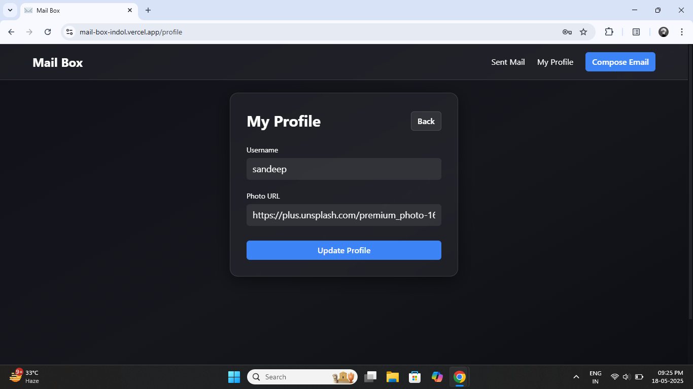